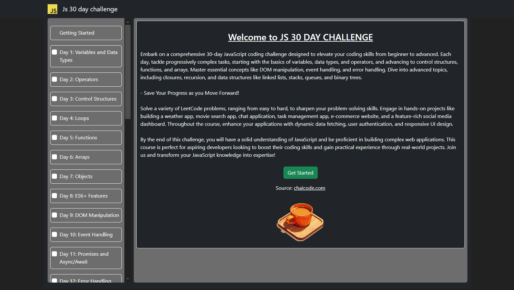

# Js 30 day challenge clone - React 

A comprehensive 30-day JavaScript coding challenge designed to elevate your coding skills from beginner to advanced. Each day, tackle progressively complex tasks, starting with the basics of variables, data types, and operators, and advancing to control structures, functions, and arrays. Master essential concepts like DOM manipulation, event handling, and error handling. Dive into advanced topics, including closures, recursion, and data structures like linked lists, stacks, queues, and binary trees.

- [Source Website](https://chaicode.com)